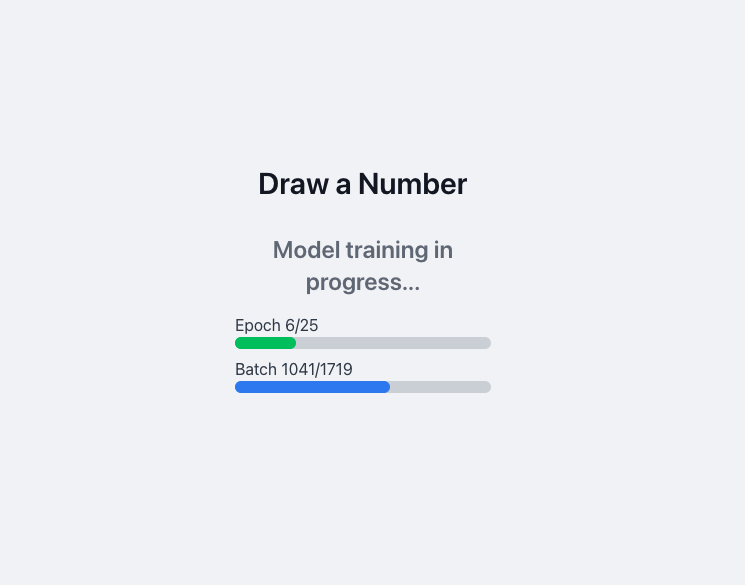
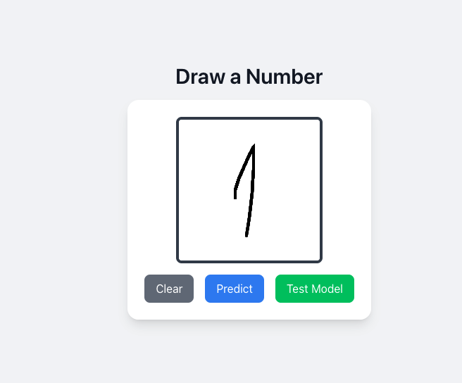

# Number AI Recognitizer (TensorFlow.js)

A simple **handwritten digit recognition app** using **TensorFlow.js**. Draw a number on the canvas, and the model predicts it.

## 🚀 Features

- **Canvas Drawing** – Users draw numbers (0-9).
- **Live Predictions** – Model processes and predicts in real-time.
- **Neural Network Model** – A trained dense network for digit recognition.

## 🛠️ Tech Stack

- **Next.js** + **TypeScript**
- **TensorFlow.js**
- **HTML5 Canvas**

## 📸 Screenshots

